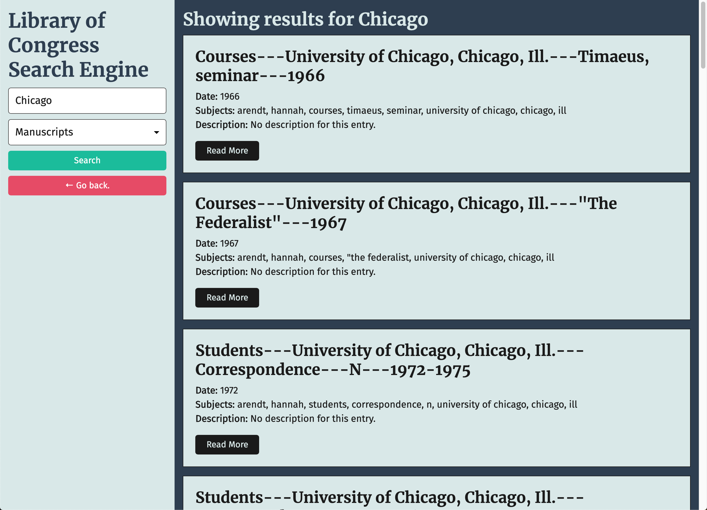

# fetchAll

## Table of Contents

* [Description](#description)
* [Installation](#installation)
* [Tools](#tools)
* [Contact](#contact)
* [License](#license)
* [Acknowledgements](#acknowledgements)

## Description

An application that searches and displays results from the Library of Congress API. The app can perform a generic search for data in all formats or select a format in the form to help filter results. Either approach allows for all of the results of the search to display on a separate page. In addition, searches can also be conducted from the results page using the search bar.

## Installation

* Clone the repo (please reference the links below).
```
git@github.com:Kimberly-Rodriguez/fetchAll.git

```

[Application-Link](https://kimberly-rodriguez.github.io/fetchAll/)


The following image demonstrates the homepage's appearance and functionality:


The following image demonstrates the search results page's appearance and functionality:




## Tools

This application was built using HTML, CSS and JavaScript principals. 

To learn about how to use this API, check out the Requests section of the [Library of Congress API documentation](https://libraryofcongress.github.io/data-exploration/).


## Contact

If you have any questions about my work OR wish to collaborate in the future please contact me via email: krodriguez.ucla@gmail.com OR feel free to connect via GitHub: [Kimberly-Rodriguez](https://github.com/Kimberly-Rodriguez).

## License 

Licensed under the [MIT License](LICENSE).


